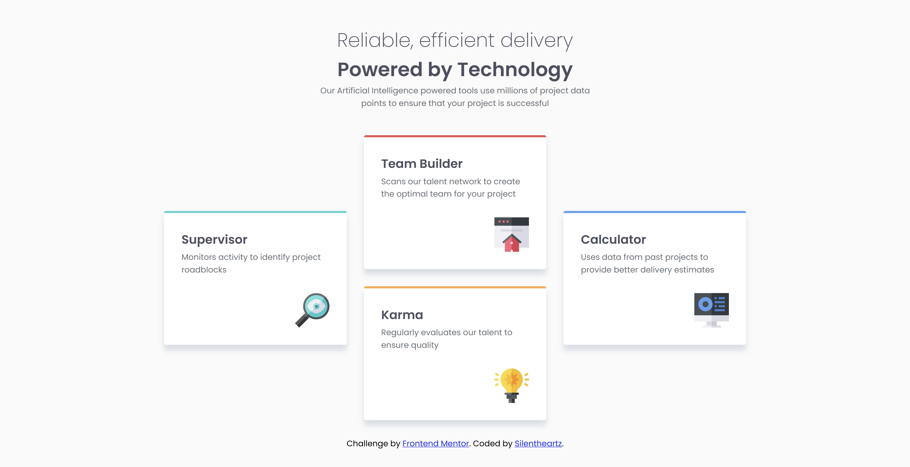

# Frontend Mentor - Four card feature section solution

This is a solution to the [Four card feature section challenge on Frontend Mentor](https://www.frontendmentor.io/challenges/four-card-feature-section-weK1eFYK). Frontend Mentor challenges help you improve your coding skills by building realistic projects.

## Table of contents

- [Overview](#overview)
  - [The challenge](#the-challenge)
  - [Screenshot](#screenshot)
  - [Links](#links)
- [My process](#my-process)
  - [Built with](#built-with)
  - [What I learned](#what-i-learned)
  - [Continued development](#continued-development)
  - [AI Collaboration](#ai-collaboration)
- [Author](#author)

## Overview

### The challenge

Users should be able to:

- View the optimal layout for the site depending on their device's screen size

### Screenshot

### Links

- Solution URL: [https://github.com/silentheartzbot/Four-card-feature-section-solution](https://github.com/silentheartzbot/Four-card-feature-section-solution)
- Live Site URL: [https://silentheartzbot.github.io/Four-card-feature-section-solution/](https://silentheartzbot.github.io/Four-card-feature-section-solution/)

## My process

### Built with

- Semantic HTML5 markup
- CSS custom properties
- Grid
- lines and rows in Grid

### What I learned

In this project I learned about grid in CSS. I learned that how grid works and lines and rows in grid how they works. I understood how to set up cards as per the design by learning about lines and rows using grid-row and grid-column. I also learned about specifity. Sometimes not all images need to be descriptive so I left alt="" empty.

### Continued development

I would continue make projects where I get understanding of grid and flexbox and be comfortable with it.

### AI Collaboration

I used Claude AI tool as mentor using AGENTS.md file suggested by frontend mentor.

## Author

- Frontend Mentor - [@yourusername](https://www.frontendmentor.io/profile/yourusername)
- Github - [silentheartzbot] (https://github.com/silentheartzbot)
